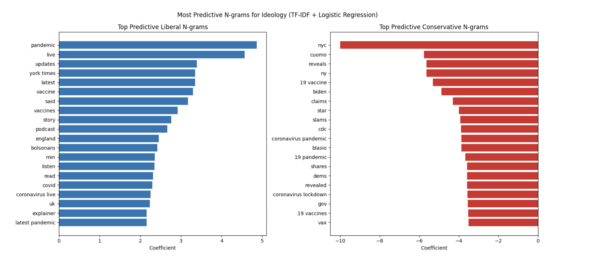
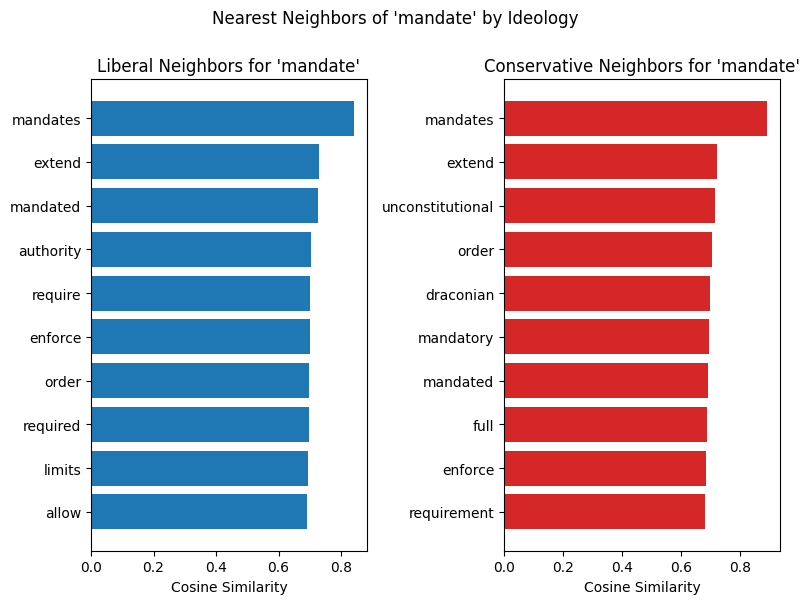
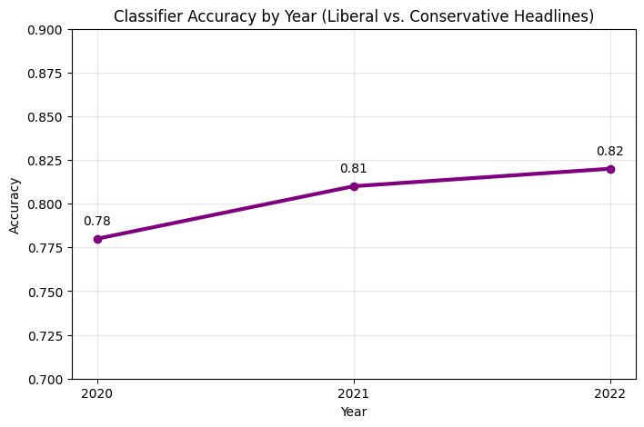
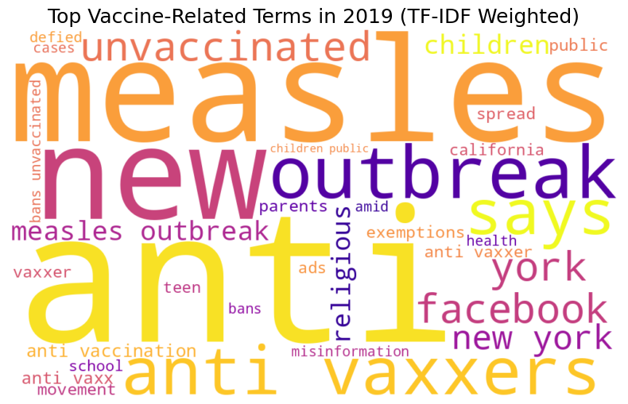
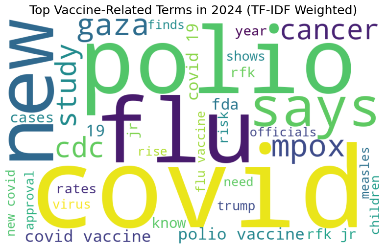
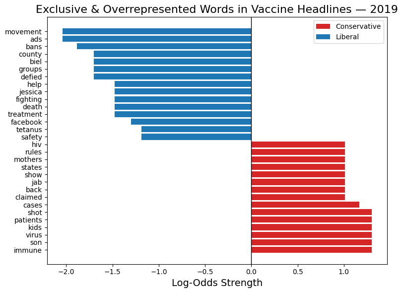
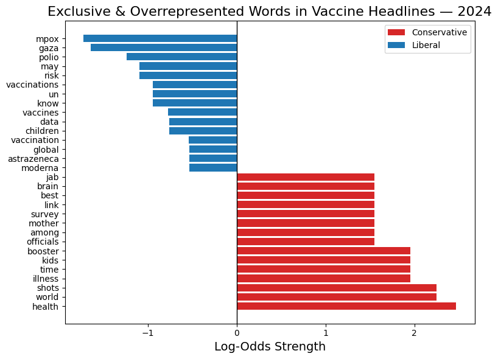

# Figures

This folder contains the main visualizations from the project analysis.

## Files

### `predictive_ngrams.png`

Shows the top n-grams most predictive of whether a COVID-19-related headline came from a liberal or conservative news outlet based on TF-IDF features and logistic regression coefficients.

### `mandate_word2vec.png`

Compares the nearest Word2Vec neighbors of the term **"mandate"** in liberal and conservative headline corpora, highlighting differences in how public-health policy was framed across ideologies.

### `classifier_accuracy.png`

Shows the accuracy of yearly logistic regression classifiers trained to distinguish liberal from conservative COVID-19-related headlines.

Classifier accuracy increased from:
- **0.78 in 2020**
- **0.81 in 2021**
- **0.82 in 2022**

This suggests that ideological differences in headline language became more pronounced over the course of the pandemic.

### `vaccine_language_2019.png`

Displays the most prominent vaccine-related language in headlines from **2019**, before the COVID-19 pandemic.

Coverage during this period focused heavily on topics such as measles outbreaks, anti-vaccination movements, and vaccine misinformation.

### `vaccine_language_2024.png`

Displays the most prominent vaccine-related language in headlines from **2024**, after the COVID-19 pandemic.

Compared with 2019, coverage shifted toward COVID-19, flu, polio, mpox, and other ongoing infectious-disease threats.

### `vaccine_log_odds_2019.png`

Shows words disproportionately associated with liberal versus conservative vaccine-related headlines in **2019** using log-odds ratios.

Pre-pandemic, liberal outlets emphasized more health- and community-related language, while conservative outlets more often emphasized personal and emotional narratives.

### `vaccine_log_odds_2024.png`

Shows words disproportionately associated with liberal versus conservative vaccine-related headlines in **2024** using log-odds ratios.

Post-pandemic, liberal outlets more often emphasized global outbreaks and scientific reporting, while conservative outlets showed more vaccine-skeptical language.
